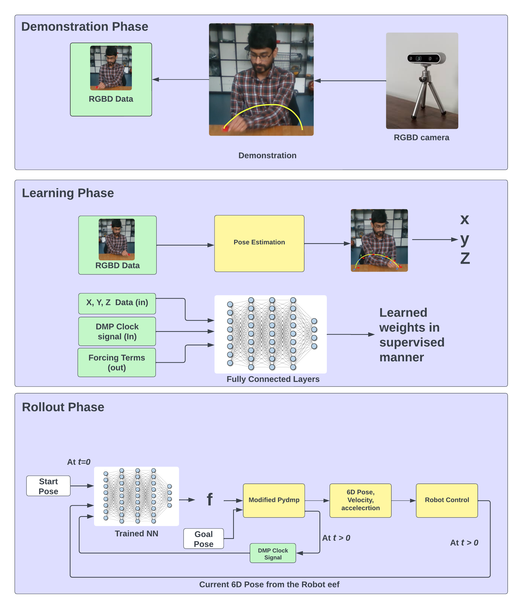
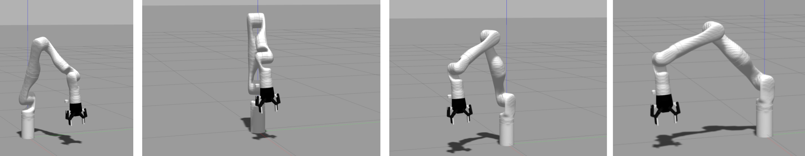

deep - pydmps
======
Architecture


Simulation output
======

## Usage

### Train

```bash
python3 pydmps.dmp_discrete.py --train
```

### Test

```bash
python3 pydmps.dmp_discrete.py --test
```

- arguments:
  - `--train`: train the model
  - `--test`: test the model
  - `--plot_3d`: plot the 3D trajectory
  - `--model_name`: model name
